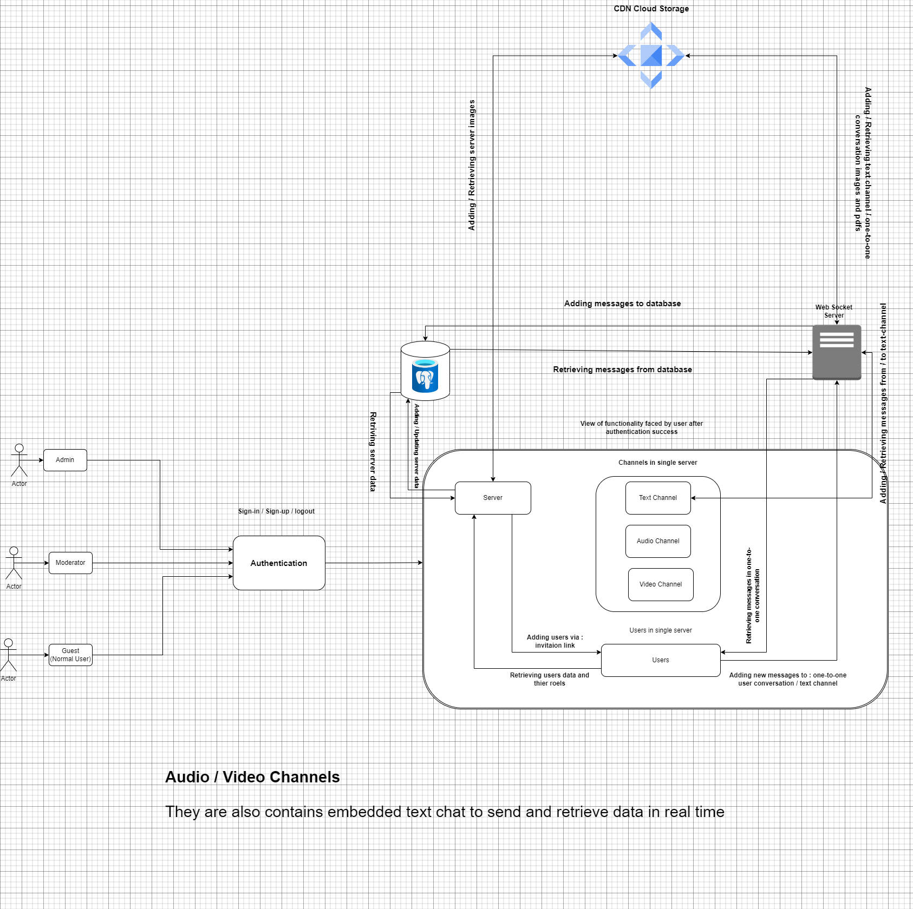
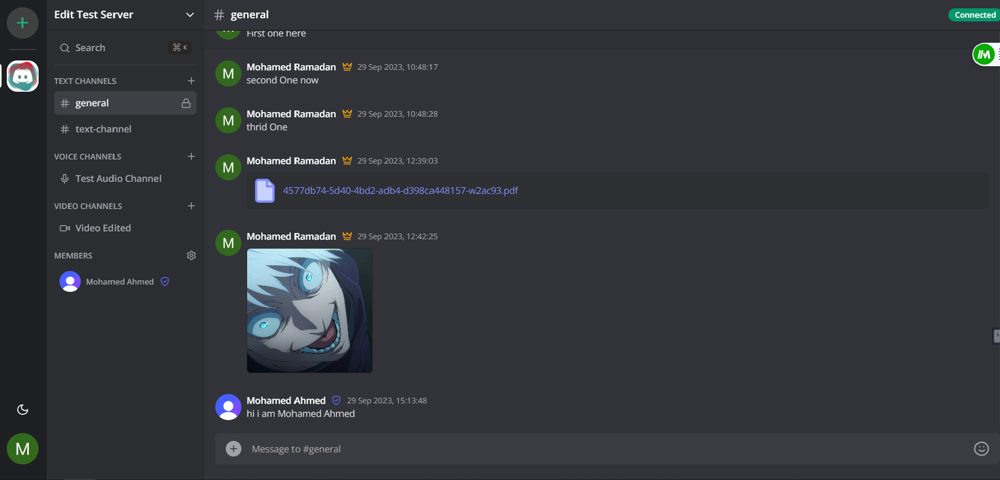
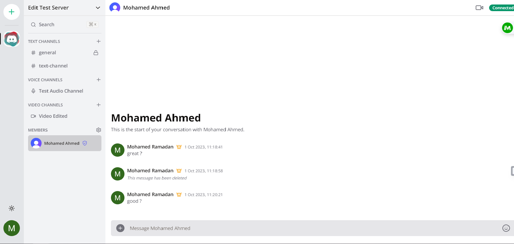
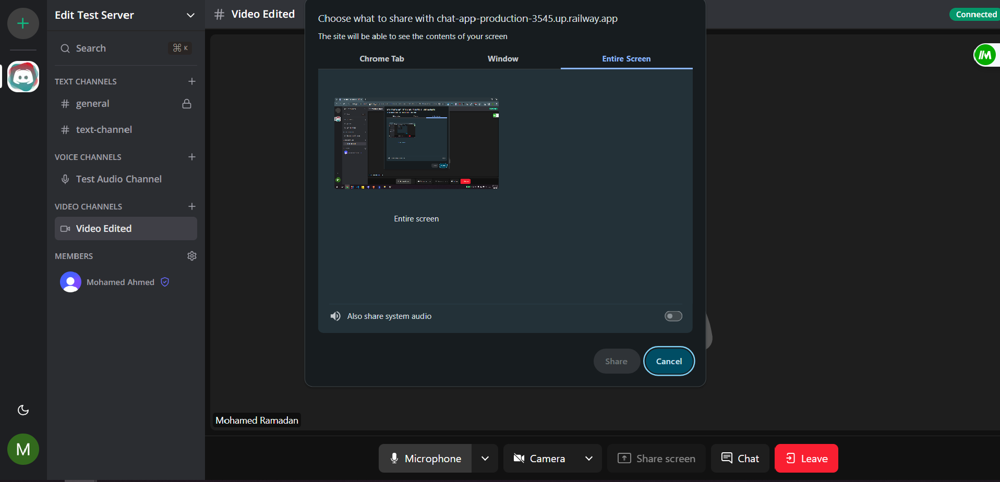
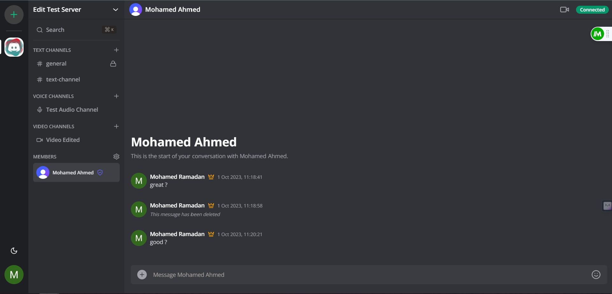

# Community Connext Application

## Table of Contents
- [Community Connext Application](#community-connext-application)
  - [Table of Contents](#table-of-contents)
  - [Overview](#overview)
  - [High-Level Design](#high-level-design)
  - [Screenshots](#screenshots)
    - [Main Screen](#main-screen)
    - [Main Screen](#main-screen-1)
    - [Video Channel](#video-channel)
    - [One-on-One Messages](#one-on-one-messages)
  - [How to Generate](#how-to-generate)
  - [TODO](#todo)

## Overview

The Community Connect Application is a dynamic platform fostering communication and collaboration within diverse communities. Tailored for friends, colleagues, or any group, it delivers a seamless chat experience enriched with versatile features. Connect effortlessly through voice channels, video channels with screen share, engage in private one-to-one messages, and participate in vibrant text channel discussions. Elevate your community interactions with our multifaceted communication tools.
## High-Level Design



*The high-level architecture features three roles (Admin, Moderator, Guest) utilizing cloud storage for PDFs and images. Servers host text, audio, and video channels with screen sharing. The system embeds chat in audio/video channels and supports one-on-one private messages.*

## Screenshots

### Main Screen


*Main Screen after logging in. Dark Mode*

### Main Screen


*Main Screen after logging in. Light Mode*

### Video Channel


*Video Channel with embedded chat and screen sharing feature*

### One-on-One Messages


*Displays private one-to-one messages*

## How to Generate

Follow these steps to generate and run the Community Chat Application:

1. **Clone the Repository:**
   ```bash
   git clone https://github.com/mohamedramadan14/community-connect-app.git
   cd community-chat-app
   ```
2. **Add required info based on .env.example file:**
4. **Install Dependencies:**
   ```bash
   npm install
   ```
5. **Run the Application:**
   ```bash
   npm start
   ```

## TODO

- Add docker compose for easier regeneration of the application
- Add more features: like real time soft delete of messages in text channels using DeepLearning Model    
